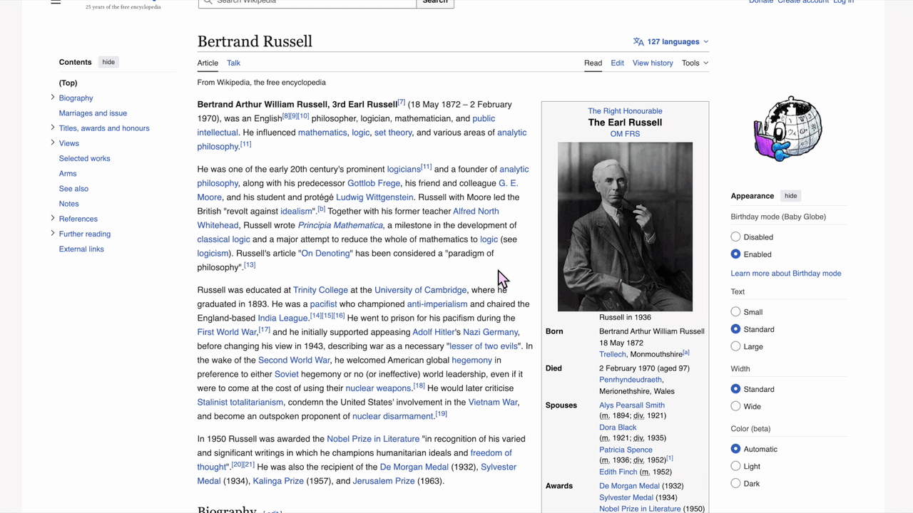
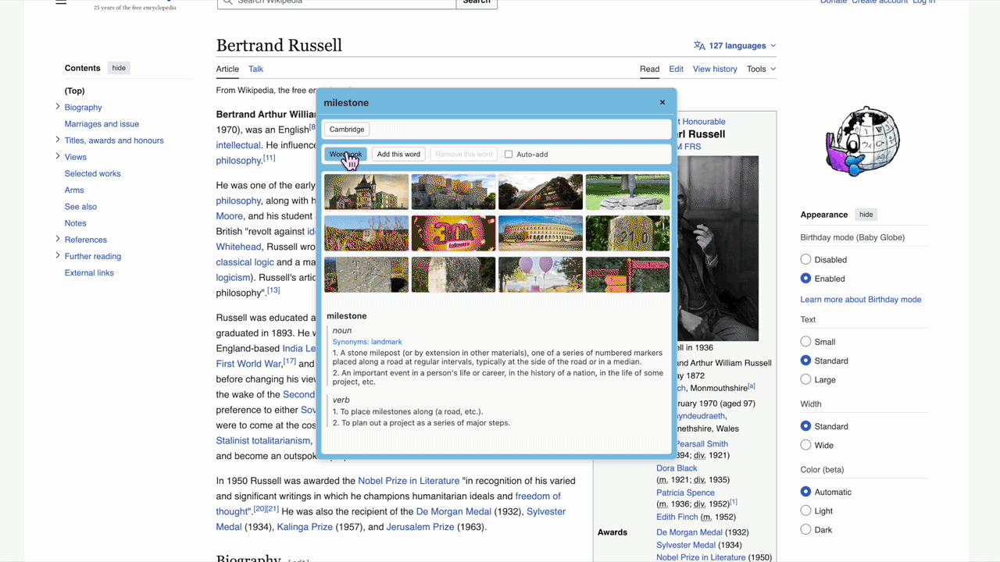

# WordLens Extension - User Guide

## A Note from Yuki
While learning languages, I often ran into a few frustrations: dictionaries without visual context, no quick way to hear the pronunciation of a word I selected, and no simple place to save and review the words I looked up.

I created WordLens to solve these problems for myself.

Along the way, I discovered many amazing free resources online, and I’m truly grateful to the people who make them available.

I plan to keep using this tool myself for a long time. If you find it helpful too, that would mean a lot to me. I’m always happy to hear feedback or suggestions—and if you enjoy using WordLens, a little encouragement goes a long way.

---

Welcome to the **WordLens** browser extension! WordLens is designed to help you quickly get dictionary definitions, audio pronunciations, visual context images, and manage your vocabulary simply by highlighting English text on any webpage.

This guide will help you configure WordLens and get the most out of its features.

                                        

---

## 1. Initial Setup (Required)

To display context images, you need to configure a free Pixabay API Key. Please follow these steps:

### 1.1 Get a Free Pixabay API Key
1. Go to [Pixabay](https://pixabay.com/).
2. Sign up for a free account and log in.
3. Visit the [Pixabay API Documentation](https://pixabay.com/api/docs/).
4. Scroll down to find the green `Your API key:` field and copy the long string of characters next to it.

### 1.2 Add the Key to the Extension
1. Click the **Extensions puzzle icon** in the top right corner of your browser. Find **WordLens** and click it to open the settings popup.
2. Locate the `Pixabay API Key` input field.
3. Paste the API key you just copied.
4. Click **Save Settings** at the bottom.

---

## 2. Features & Usage
 
### 2.1 Basic Translation & Audio
- **Lookup**: On any English webpage, **highlight** any English word or short phrase (up to 50 characters). Release your mouse, and the WordLens popup will appear dead-center on your screen.
- **Pronunciation**: In the popup, click the 🔊 (speaker) icon next to the phonetic spelling to hear the native pronunciation.
- **Auto-play**: If you want the pronunciation to play automatically every time you look up a word, check the `Auto-play` box next to the speaker icon.
- **Close Popup**: Click the `X` in the top right corner of the popup, or simply click anywhere else on the webpage. You can also drag the popup around by clicking and holding its top header.

### 2.2 Custom Dictionary Links
If you need more detailed definitions, you can quickly jump to professional online dictionaries:
1. When the popup is open, you will see dictionary buttons like **Cambridge** in the toolbar.
2. Click a button to search for your selected word directly in a new tab.

**How to add/edit custom dictionaries:**
1. Click the WordLens icon in your browser toolbar (or the ⚙️ gear icon in the translation popup) to open the **Settings Menu**.
2. Under `Custom Dictionaries`, you can change the dictionary name (e.g., "Oxford") and the search URL base (e.g., `https://www.oxfordlearnersdictionaries.com/definition/english/`).
3. WordLens will automatically append your selected word to the end of this URL when clicked.
4. You can set up to 5 custom dictionary shortcuts.

### 2.3 Wordbook (Vocabulary Manager)
Found a word you want to memorize? WordLens includes a lightweight Wordbook module.
 
- **Manual Add**: Click the `Add this word` button in the popup to save the word, its primary definition, and an example sentence to your Wordbook. (A green `+1` animation will appear confirming it was saved).
- **Remove**: Click `Remove this word` to delete it.
- **Auto-add**: Check the `Auto-add` box to automatically save every new word you highlight to your Wordbook.
- **View Wordbook**: Click the blue `Wordbook` button in the popup to open your dedicated vocabulary management page. Here you can:
  - Review all saved words, definitions, and examples.
  - **Export CSV**: Download your vocabulary list for easy import into Anki, Quizlet, or other flashcard apps.
  - **Copy to Clipboard**: One-click copy the list as tab-separated text.
  - *Note: To keep the extension lightweight, the Wordbook stores up to 100 words. Once full, please export your list and click `Clear Wordbook` to make room for more.*

---

## 3. Feedback & Suggestions

WordLens is continuously being refined. If you encounter any bugs (e.g., images failing to load, no audio, layout issues) or have feature requests, I would love to hear from you!

**How to submit feedback:**
- **GitHub Issues** : Please submit an issue on [GitHub Repository](https://github.com/YuKissGit/WordLens--chrome-extention).
- **Email**: You can also reach out via email at [yukiw.code@gmail.com].

Thank you for using WordLens, and happy learning!
